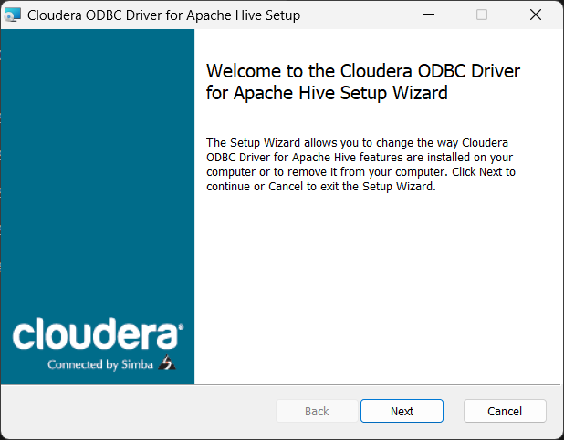

## Installation du Driver Hive pour R

### Windows

1. Téléchargez le Driver ODBC Hive pour Windows depuis ce [lien](https://www.cloudera.com/downloads/connectors/hive/odbc/2-6-1.html).



2. Une fois le téléchargement terminé, allez dans [Panneau de configuration -> Système et sécurité -> Outils windows] de votre ordinateur et lancez "ODBC Data Source Administrator (XX-BITS)" (32 ou 64 bits selon votre ordinateur) :


3. Choisisez Hive Driver puis cliquez sur le bouton "Ajouter" (ADD) :


Une fenêtre s'affichera :

4. Sous l'onglet "USER DSN", sélectionnez le driver Cloudera que vous venez d'installer :


5. Remplissez avec les informations suivantes :


6. Faites la même chose dans l'onglet "SYSTEM DSN" :


### R

1. Exécutez les lignes de commande suivantes (dans le fichier `1-DriverConnection.R`) :

```r
install.packages(c("RJDBC", "DBI", "rJava", "odbc"))
library(odbc)
library(DBI)
library(rJava)
library(RJDBC)

# Connexion à Hive
hiveDB <- dbConnect(odbc::odbc(), "Hive Driver")
```

Apres cette étape, si vous utilisez RStudio vous devez voir la connexion du HIVE comme suit : 


Pour tester que tout marche bien on execute une simple requete SQL :

```r
dbGetQuery(hiveDB,"select * from marketing_ext")
```


